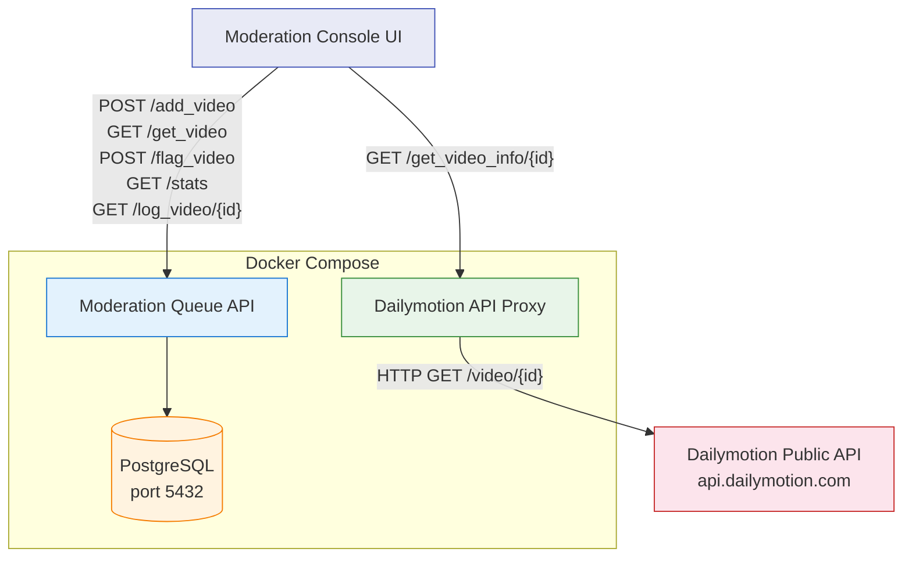
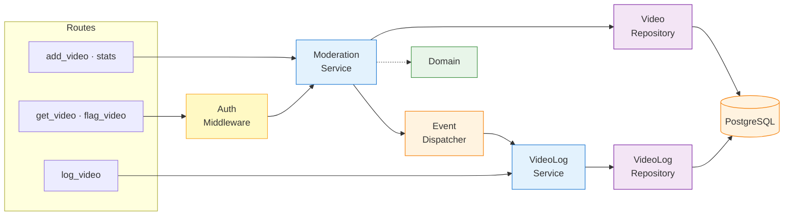
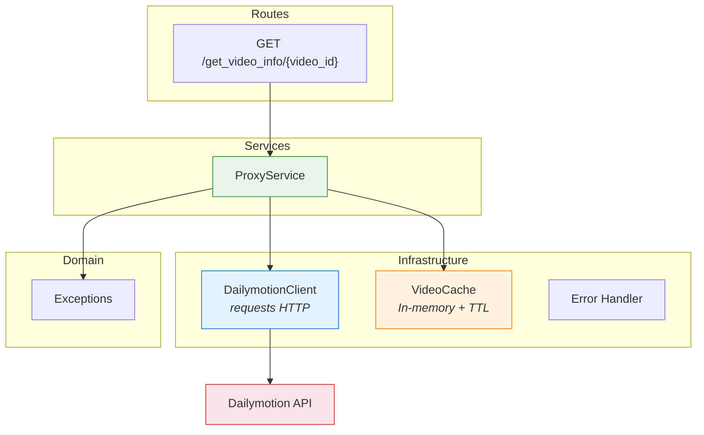
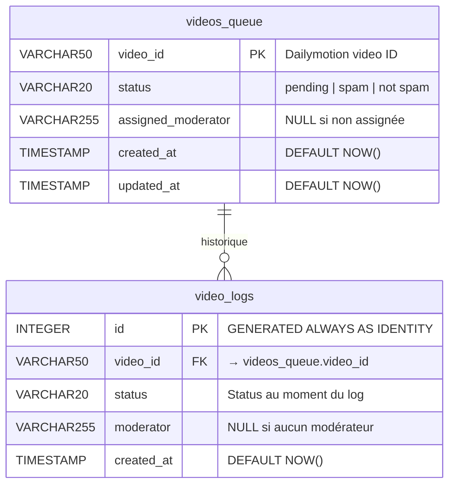
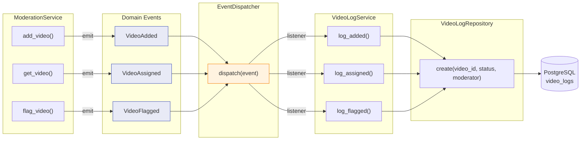
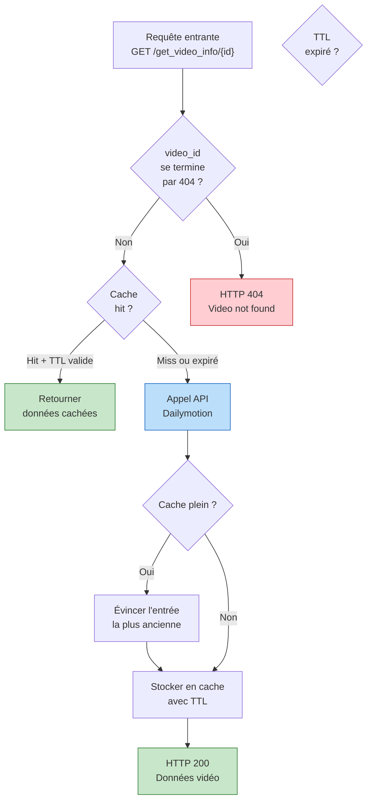

# Architecture Diagrams — Moderation API

## 1. Vue d'ensemble du système

---

## 2. Architecture en couches — Moderation Queue

---

## 3. Architecture en couches — Dailymotion Proxy

---

## 4. Schéma de la base de données

**Index** :
- `idx_videos_pending` — `videos_queue(created_at) WHERE status = 'pending'` → accélère le FIFO
- `idx_video_logs_video_id` — `video_logs(video_id)` → accélère l'audit

---

## 5. Système d'événements (Event-Driven Logging)

---

## 6. Stratégie de cache — Dailymotion Proxy

---
